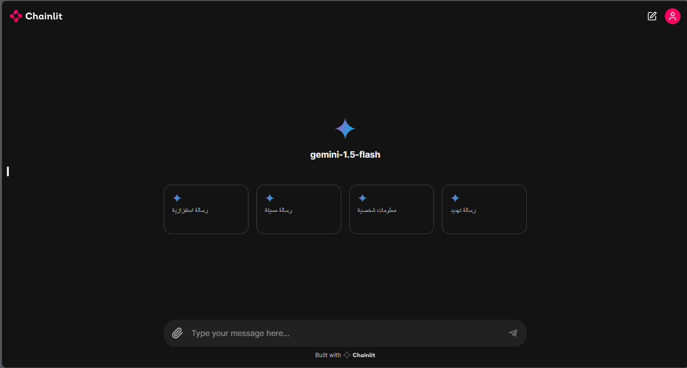

# Agent Shield: AI-Powered Content Guardian 🛡️🤖


<!-- Image -->


</br></br>

Welcome to Agent Shield! 🚀🤖 This repository houses an advanced AI agent designed to safeguard digital environments by detecting and categorizing harmful content, including hate speech and personal information. Agent Shield empowers developers to integrate robust content moderation capabilities into their applications, ensuring safer and more secure online interactions.

## Introduction

In today's interconnected world, maintaining a safe and respectful digital space is crucial. Agent Shield serves as your vigilant ally in this endeavor, leveraging state-of-the-art AI technologies to identify and categorize potentially harmful content with precision and efficiency. Whether you're developing a social media platform, chat application, or any online service, Agent Shield equips you with powerful tools to uphold community standards and user safety.

## Prerequisites

Before using the `Agent Shield` project, you need to obtain:

- **Google API Key**: The Google API key is required for utilizing language models and AI services.
  Obtain an API key from Google Cloud Console: [https://console.cloud.google.com/apis/credentials](https://console.cloud.google.com/apis/credentials). Once obtained, configure it in the `.env` file of Agent Shield.


## Configuration

Agent Shield is highly configurable. To set up your environment:

1. Clone this repository to your local machine:

   ```bash
   git clone https://github.com/yourusername/agent-shield
   ```

2. Navigate to the project directory:

   ```bash
   cd agent_shield
   ```

3. Set up the `.env` file:

   - Rename `.env.example` to `.env`.
   - Open `.env` and configure the following variables:

     ```plaintext
     GOOGLE_API_KEY=your-google-api-key-here
     ```

4. Save and close `.env`.


## Getting Started

To start using Agent Shield, follow these steps:

### Using Docker

For a streamlined setup using Docker:

1. Build and run the Docker containers:

   ```bash
   docker-compose up -d --build
   ```
2. Access the API:

      Open your browser and navigate to [`http://localhost:7651`](http://localhost:7651) to access the Agent Shield API.

3. Access the UI:
   
      Open your browser and navigate to [`http://localhost:7652`](http://localhost:7652) to access the Agent Shield UI.

### Local usage

1. **Create a Virtual Environment**: Set up a virtual environment to manage dependencies.

   ```bash
   python -m venv .venv
   .venv\Scripts\activate
   ```

2. **Install Poetry**: Install Poetry to manage project dependencies.

   ```bash
   pip install poetry
   ```

3. **Install Dependencies**: Install the project dependencies using Poetry.

   ```bash
   poetry install
   ```

4. **Install executable**: Install the Agent Shield executable to run the AI agent.

   ```bash
   pip install --editable .
   ```

5. **Run the AI Agent**: 
    
    Start the AI agent to handle content moderation queries.

    1. **Run the AI Agent**: Start the AI agent to handle content moderation queries.

        ```bash
        agent-shield ask "Is this a safe message?" 
        ```
        The AI agent will analyze the message and provide a content moderation decision.
        ```bash
        agent-shield categories "HARM_CATEGORY_DEROGATORY"
        agent-shield categories 2
        ```

    2. **Utilize the API**: Access the Agent Shield API for integrating content moderation into your applications.

        ```bash
        agent-shield run api
        ```

        The API will be accessible at [`http://localhost:7651`](http://localhost:7651) by default.

    3. **Run the UI**: Optionally, run the Agent Shield UI for a graphical interface to interact with the AI agent.

        ```bash
        agent-shield run ui
        ```

        The UI will be available at [`http://localhost:7652`](http://localhost:7652) in your browser.

---

## Author 🧑‍💻

Agent Shield is developed by `Mohamad Aboud`. Explore more about the author and their projects on [GitHub](https://github.com/mohamadaboud). 💻😊

We hope Agent Shield empowers you to create safer digital spaces! Happy moderating! 🛡️🌐
